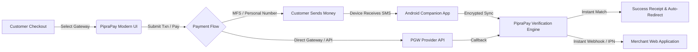

# <div align="center">💳 PipraPay — NextGen Payment Automation</div>

<p align="center">
  <strong>The Ultimate Self-Hosted Gateway Aggregator & Automated SMS Payment Verification Engine</strong><br>
  <em>Modernized UI • Lightning-Fast Verification • Uncompromised Core Security</em>
</p>

<p align="center">
  <a href="#-core-architecture"></a>
  <a href="#-security-and-integrity"></a>
  <a href="#-automated-verification-workflow"></a>
  <a href="#-supported-gateways"></a>
  <a href="LICENSE"></a>
</p>

<p align="center">
  
  
  
  
  
</p>

---

## ⚡ Overview & What's New

This repository is a **Modernized UI/UX Edition** of the open-source **[PipraPay](https://piprapay.com)** automated payment ecosystem.

```text
┌────────────────────────────────────────────────────────────────────────────────────────┐
│  ✨ SPECIAL EDITION HIGHLIGHTS                                                         │
│                                                                                        │
│  ✔ Modern Dark/Glassmorphism Checkout Interface                                       │
│  ✔ Revamped Customer-Facing Flow (Selection ➔ Instructions ➔ Verification ➔ Receipt)  │
│  ✔ Automated SMS-Based Payment Verification Pipeline                                  │
│  ✔ Modern Success & Failure Screens with Instant Copying & Live Redirection            │
│  ✔ 100% Untouched Core Security, Encryption & Database Schemas                        │
└────────────────────────────────────────────────────────────────────────────────────────┘
```

> [!IMPORTANT]
> **Zero Security Alterations**: The underlying cryptographic hashing, signature validations, database transactions, and companion token protocols remain **100% unaltered** from upstream PipraPay. This update focuses entirely on front-end aesthetics, streamlined user flow, and developer experience.

---

## 🏗️ System Architecture & Workflow

PipraPay bridges non-API personal wallets, merchant gateways, and SMS alerts into a single programmable unified payment pipeline:



---

## 🎨 UI/UX Transformation Showcase

| Screen | Focus | Description |
| :--- | :---: | :--- |
| **💳 Modern Checkout** | `payments/` | Sleek dark-mode container with dynamic timer counters, instant account number copying, and step-by-step guidance. |
| **✅ Success Screen** | `success.php` | High-clarity digital receipt displaying transaction ID, amount, payment channel badge, and animated redirection. |
| **⚠️ Error Recovery** | `error.php` | Informative state screen detailing error reasons, retry mechanisms, and merchant support identifiers. |
| **📚 Developer Portal** | `/docs/` | Interactive developer playground featuring cURL, PHP, JS snippets, copy-paste shortcuts, and payload inspectors. |

---

## 🌐 Supported Gateways & Integrations

PipraPay supports an extensive matrix of payment methods out-of-the-box:

<details open>
<summary><b>📱 Mobile Financial Services (MFS) & Bangladesh Networks</b></summary>

<br>

| Provider | Supported Account Types | Method |
| :--- | :--- | :--- |
| **bKash** | Personal, Merchant, Agent | Automatic SMS Match / API |
| **Nagad** | Personal, Merchant, Agent | Automatic SMS Match / API |
| **Rocket** | Personal, Merchant, Agent | Automatic SMS Match / USSD |
| **Upay** | Personal, Merchant, Agent | Automatic SMS Match / App Sync |
| **Cellfin** | Personal, Virtual Card | Instant Verification |
| **OK Wallet** | Personal, Merchant, Agent | Automated Verification |
| **Tap / TeleCash** | Personal, Merchant, Agent | Automated Verification |

</details>

<details>
<summary><b>💳 Global Gateways, Crypto & Banking Methods</b></summary>

<br>

| Gateway / Channel | Type | Supported Features |
| :--- | :--- | :--- |
| **Stripe** | Credit / Debit Cards | Instant Webhook, 3D-Secure |
| **PayPal** | Wallet / Cards | IPN, Instant Checkout |
| **SSLCommerz** | Cards, Netbanking, MFS | Hosted Checkout & IPN |
| **Shurjopay** | Gateway Aggregator | Instant Verification |
| **NOWPayments & OxaPay** | Cryptocurrency | Auto Confirmations (BTC, USDT, etc.) |
| **Wise / Payoneer / Payeer**| International Transfer | Manual / Automated Matching |

</details>

---

## 🚀 Quick Setup & Installation

### 1. Requirements
* **PHP**: `8.0`, `8.1`, or `8.2`
* **PHP Extensions**: `curl`, `pdo_mysql`, `mbstring`, `openssl`, `json`, `gd`
* **Database**: MySQL `5.7+` or MariaDB `10.3+`
* **Web Server**: Apache (`mod_rewrite` enabled) or Nginx

### 2. Fast Installation

```bash
# 1. Clone the repository into your web root
git clone https://github.com/jisan789/piprapay.git /var/www/html/payments

# 2. Set directory permissions
cd /var/www/html/payments
chmod -R 755 .
chmod -R 777 pp-content/pp-upload pp-media/storage

# 3. Open the web installer in your browser:
# http://localhost/payments/pp-content/pp-install/
```

### 3. Setup Android Companion (For Automated SMS Verification)

```text
Step 1 ➔ Install PipraPay Companion APK on your SMS-receiving device.
Step 2 ➔ In PipraPay Admin: Go to "Settings" > "Companion App".
Step 3 ➔ Copy the one-time authentication token.
Step 4 ➔ Enter the token in the Android app and tap "Start Syncing".
```

---

## 📖 How to Create Orders (Checkout API Guide)

Integrating PipraPay into your application or eCommerce store is straightforward. Follow the step-by-step guide below to initialize payments, redirect customers, and receive automated notifications.

---

### 1️⃣ Authentication & Endpoint

* **Endpoint**: `POST https://yourdomain.com/api/checkout/redirect`
* **Headers**:
  ```http
  MHS-PIPRAPAY-API-KEY: YOUR_MERCHANT_API_KEY
  Content-Type: application/json
  ```

---

### 2️⃣ Request Parameters

| Parameter | Type | Required | Description |
| :--- | :---: | :---: | :--- |
| `full_name` | `string` | **Yes** | Full customer name (e.g. `John Doe`). |
| `email_address` | `string` | **Yes** | Customer email address for transaction invoices and records. |
| `mobile_number` | `string` | **Yes** | Customer mobile number (e.g. `01700000000`). |
| `amount` | `number` | **Yes** | Order payable amount (must be positive, e.g. `500.00`). |
| `currency` | `string` | **Yes** | Active brand currency code (e.g. `BDT`, `USD`, `INR`). |
| `return_url` | `string` | *Optional* | URL to redirect customer after payment completion. |
| `webhook_url` | `string` | *Optional* | Server webhook URL to receive instant asynchronous POST notifications. |
| `metadata` | `object` | *Optional* | Custom merchant data object (e.g. `{"order_id": "ORD-9021", "user_id": "42"}`). |

---

### 3️⃣ Code Implementation Examples

<details open>
<summary><b>🐘 PHP (cURL Implementation)</b></summary>

```php
<?php
$apiKey   = "YOUR_MERCHANT_API_KEY";
$endpoint = "https://yourdomain.com/api/checkout/redirect";

$orderData = [
    "full_name"     => "John Doe",
    "email_address" => "john@example.com",
    "mobile_number" => "01700000000",
    "amount"        => 500.00,
    "currency"      => "BDT",
    "return_url"    => "https://merchant-store.com/payment/callback",
    "webhook_url"   => "https://merchant-store.com/payment/webhook",
    "metadata"      => [
        "order_id"    => "INV-10029",
        "customer_id" => "CUST-8812"
    ]
];

$ch = curl_init($endpoint);
curl_setopt($ch, CURLOPT_RETURNTRANSFER, true);
curl_setopt($ch, CURLOPT_POST, true);
curl_setopt($ch, CURLOPT_POSTFIELDS, json_encode($orderData));
curl_setopt($ch, CURLOPT_HTTPHEADER, [
    "MHS-PIPRAPAY-API-KEY: " . $apiKey,
    "Content-Type: application/json"
]);

$response = curl_exec($ch);
curl_close($ch);

$result = json_decode($response, true);

if (!empty($result['pp_url'])) {
    // Redirect customer to the PipraPay checkout page
    header("Location: " . $result['pp_url']);
    exit;
} else {
    echo "Payment initialization failed: " . ($result['error']['message'] ?? 'Unknown error');
}
```
</details>

<details>
<summary><b>🟢 Node.js (Axios Implementation)</b></summary>

```javascript
const axios = require('axios');

async function createPipraPayOrder() {
  const apiKey = 'YOUR_MERCHANT_API_KEY';
  const endpoint = 'https://yourdomain.com/api/checkout/redirect';

  const orderData = {
    full_name: 'John Doe',
    email_address: 'john@example.com',
    mobile_number: '01700000000',
    amount: 500.00,
    currency: 'BDT',
    return_url: 'https://merchant-store.com/payment/callback',
    webhook_url: 'https://merchant-store.com/payment/webhook',
    metadata: {
      order_id: 'INV-10029',
      customer_id: 'CUST-8812'
    }
  };

  try {
    const { data } = await axios.post(endpoint, orderData, {
      headers: {
        'MHS-PIPRAPAY-API-KEY': apiKey,
        'Content-Type': 'application/json'
      }
    });

    console.log('Payment ID:', data.pp_id);
    console.log('Redirect User to:', data.pp_url);
    // Express response redirect: res.redirect(data.pp_url);
  } catch (error) {
    console.error('Order creation error:', error.response?.data || error.message);
  }
}

createPipraPayOrder();
```
</details>

<details>
<summary><b>🐍 Python (Requests Implementation)</b></summary>

```python
import requests

api_key = "YOUR_MERCHANT_API_KEY"
endpoint = "https://yourdomain.com/api/checkout/redirect"

payload = {
    "full_name": "John Doe",
    "email_address": "john@example.com",
    "mobile_number": "01700000000",
    "amount": 500.00,
    "currency": "BDT",
    "return_url": "https://merchant-store.com/payment/callback",
    "webhook_url": "https://merchant-store.com/payment/webhook",
    "metadata": {
        "order_id": "INV-10029"
    }
}

headers = {
    "MHS-PIPRAPAY-API-KEY": api_key,
    "Content-Type": "application/json"
}

response = requests.post(endpoint, json=payload, headers=headers)
data = response.json()

if "pp_url" in data:
    print("Redirect customer to:", data["pp_url"])
else:
    print("Failed to initialize:", data.get("error", {}).get("message"))
```
</details>

<details>
<summary><b>💻 cURL Command</b></summary>

```bash
curl -X POST https://yourdomain.com/api/checkout/redirect \
  -H "MHS-PIPRAPAY-API-KEY: YOUR_MERCHANT_API_KEY" \
  -H "Content-Type: application/json" \
  -d '{
    "full_name": "John Doe",
    "email_address": "john@example.com",
    "mobile_number": "01700000000",
    "amount": 500.00,
    "currency": "BDT",
    "return_url": "https://merchant-store.com/payment/callback",
    "webhook_url": "https://merchant-store.com/payment/webhook",
    "metadata": {
      "order_id": "INV-10029"
    }
  }'
```
</details>

---

### 4️⃣ Success Response (HTTP 200 OK)

When an order is created successfully, PipraPay returns a 27-character payment reference identifier (`pp_id`) and the hosted checkout payment URL (`pp_url`):

```json
{
  "pp_id": "9A8B7C6D5E4F3G2H1I0J1K2L3M4",
  "pp_url": "https://yourdomain.com/payment/9A8B7C6D5E4F3G2H1I0J1K2L3M4"
}
```

---

### 5️⃣ Handling Webhooks & Verification

#### A. Webhook Notification (Instant Server-to-Server IPN)
When payment is approved (either automatically via SMS matching or gateway callback), PipraPay sends a `POST` request to your `webhook_url`:

```json
{
  "event": "payment.completed",
  "pp_id": "9A8B7C6D5E4F3G2H1I0J1K2L3M4",
  "status": "completed",
  "amount": "500.00",
  "currency": "BDT",
  "transaction_id": "BKX78942918",
  "gateway": "bkash-personal",
  "metadata": {
    "order_id": "INV-10029",
    "customer_id": "CUST-8812"
  }
}
```

#### B. Manual Payment Verification API
You can also verify any transaction status server-side at any time:

* **Endpoint**: `POST https://yourdomain.com/api/verify-payment`
* **Request**:
  ```json
  {
    "pp_id": "9A8B7C6D5E4F3G2H1I0J1K2L3M4"
  }
  ```
* **Response**:
  ```json
  {
    "status": "completed",
    "pp_id": "9A8B7C6D5E4F3G2H1I0J1K2L3M4",
    "amount": "500.00",
    "currency": "BDT",
    "transaction_id": "BKX78942918",
    "verified_at": "2026-10-01 00:15:30"
  }
  ```

---

## 🔒 Security & Verification Guarantee

```text
  🛡️ SECURE SYSTEM INTEGRITY
  ────────────────────────────────────────────────────────────────
  [✓] All payment calculations are processed server-side.
  [✓] Transaction IDs are cryptographically hashed & uniqueness-checked.
  [✓] SQL injection protection via PDO Prepared Statements.
  [✓] Webhook notifications are cryptographically signed.
  [✓] Sensitive API keys are encrypted at rest.
```

---

## 📄 License & Credits

- **Original Engine**: Designed & conceptualized by the [PipraPay](https://piprapay.com) Community.
- **License**: Released under the **GNU Affero General Public License v3.0 (AGPL-3.0)**.
- **Modifications**: UI design system overhaul, modern dark-mode payment screens, success/error feedback pages, and comprehensive developer documentation.

<div align="center">
  <sub>Crafted for modern fintech workflows • Built on open-source</sub>
</div>
